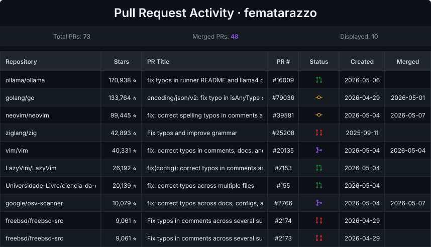
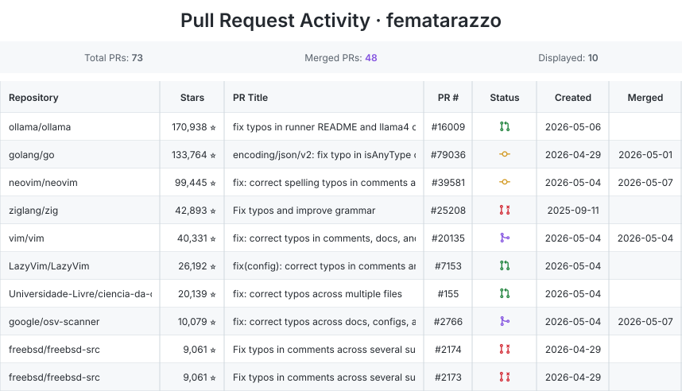
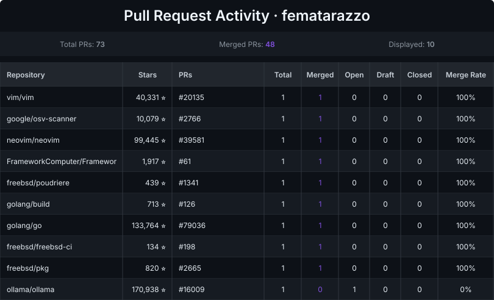

# pullscape

Generates SVG cards showing a GitHub user's pull request history. Embed them in a profile README or anywhere that renders images.

**Live:** https://pullscape.fly.dev

## Usage

```
GET https://pullscape.fly.dev/api/github-pr-stats?username=<github_username>
```

## Preview

### PR list — dark theme



```
?username=fematarazzo&theme=dark&min_stars=50&sort=stars_desc&limit=10
```

### PR list — light theme



```
?username=fematarazzo&theme=light&min_stars=50&sort=stars_desc&limit=10
```

### Repo aggregate mode



```
?username=fematarazzo&theme=dark&mode=repo-aggregate&sort=merged_rate_desc&min_stars=50
```

---

## Parameters

| Parameter  | Default            | Description                                                                 |
|------------|--------------------|-----------------------------------------------------------------------------|
| `username` | required           | GitHub username                                                             |
| `theme`    | `dark`             | `dark` or `light`                                                           |
| `mode`     | PR list            | `repo-aggregate` to group by repository instead of listing individual PRs  |
| `status`   | `all`              | Filter by status: `merged`, `upstream`, `open`, `draft`, `closed`, or comma-separated  |
| `min_stars`| `0`                | Only include PRs from repos with at least this many stars                   |
| `limit`    | `10`               | Max rows to show                                                            |
| `sort`     | `status,stars_desc`| Sort fields, comma-separated (see below)                                    |
| `fields`   | all columns        | Columns to include, comma-separated (see below)                             |
| `stats`    | `all`              | Which summary stats to show in the header bar                               |

### Status values

| Status | Meaning |
|--------|---------|
| `merged` | PR was directly merged on GitHub, or closed by a cherry-picked commit |
| `upstream` | PR was closed because a maintainer pulled the changes into their own PR or via an external tool (Gerrit, Phabricator) — contribution accepted but not directly merged |
| `open` | Still open |
| `draft` | Open as a draft |
| `closed` | Closed without the changes being accepted |

Both `merged` and `upstream` count toward the merged tally and merge rate.

### Sort options

PR list mode: `stars_desc`, `stars_asc`, `created_date_desc`, `created_date_asc`, `status`

Repo aggregate mode: `stars_desc`, `stars_asc`, `merged_desc`, `merged_asc`, `merged_rate_desc`, `merged_rate_asc`

### Field options

PR list: `repo`, `stars`, `pr_title`, `pr_number`, `status`, `created_date`, `merged_date`

Repo aggregate: `repo`, `stars`, `pr_numbers`, `total`, `merged`, `open`, `draft`, `closed`, `merged_rate`

### Stats options

`total_pr`, `merged_pr`, `display_pr`, `repos_with_pr`, `repos_with_merged_pr`, `showing_repos`

## Examples

```
https://pullscape.fly.dev/api/github-pr-stats?username=torvalds&theme=light&limit=5
https://pullscape.fly.dev/api/github-pr-stats?username=torvalds&status=merged&sort=stars_desc&limit=10
https://pullscape.fly.dev/api/github-pr-stats?username=torvalds&mode=repo-aggregate&sort=merged_rate_desc
https://pullscape.fly.dev/api/github-pr-stats?username=torvalds&fields=repo,stars,status&stats=total_pr,merged_pr
```

To embed in a GitHub README:

```md

```

## Running locally

```sh
cp .env.example .env
# add your GitHub token to .env
go run .
```

The server starts on port 8080 by default. Set `PORT` in `.env` to change it.

## Environment variables

| Variable       | Required | Description                                              |
|----------------|----------|----------------------------------------------------------|
| `GITHUB_TOKEN` | yes      | GitHub personal access token. Needs `read:user` scope.   |
| `PORT`         | no       | Port to listen on. Defaults to `8080`.                   |

## Caching

In-process `sync.Map` keyed by the request query string. Entries never
expire; once an entry is older than 12h, the next request serves it
immediately and triggers a background refresh from GitHub. This keeps
responses sub-millisecond after the first cold fetch, which matters for
embedders like GitHub Camo that enforce short fetch timeouts.

## Deployment

The repo includes a `Dockerfile` and `fly.toml` for deploying to Fly.io.

```sh
fly apps create pullscape
fly secrets set GITHUB_TOKEN=your_token_here
fly deploy
```
